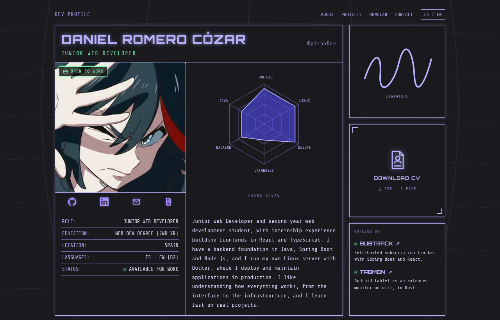

# portfolio

My personal portfolio as a Junior Web Developer, live at **[portfolio.pichahouse.es](https://portfolio.pichahouse.es)**.



A single bilingual page (Spanish / English) styled as a sci-fi "dev dossier", self-hosted on my own homelab.

## What's inside

- **Profile:** role, skills focus radar, stack, availability and CV download.
- **Projects:** subtrack, tabmon and a CI/CD pipeline, each with a screenshot or real snippet and what I learned.
- **Homelab and Pichaflix:** the services I run at home and how my private streaming platform works end to end.
- **Experience and education**, and a contact section.

## Stack

Plain **HTML, CSS and JavaScript (ES modules)**, no framework and no build step.

- Texts live in `site/i18n/{es,en}.json` and are applied through `data-i18n` attributes. The language follows the browser and is remembered in `localStorage`.
- Projects, homelab, timeline and stack are JSON files in `site/data/` rendered by small functions in `site/js/render.js`. Everything coming from JSON is HTML-escaped.
- The skills radar is an SVG generated in `site/js/radar.js`.
- Fonts (Orbitron, Share Tech Mono) are self-hosted. Icons are an inline SVG sprite.

## Project structure

```
site/            everything that gets published
  index.html
  css/style.css
  js/            i18n.js · render.js · radar.js · main.js
  i18n/          es.json · en.json
  data/          profile · projects · homelab · pichaflix · timeline · stack
  assets/        fonts · images · CV
tests/           unit tests (node:test)
tools/           og.html + make-og.sh to regenerate the share preview image
compose.yaml     nginx:alpine serving ./site
nginx.conf       gzip, static caching, revalidation for css/js/json
deploy.sh        rsync to the server + reload
```

## Run it locally

```sh
python3 -m http.server 8000 -d site   # http://localhost:8000
npm test                              # unit tests, no dependencies
```

Or the same container used in production:

```sh
docker compose up -d                  # http://localhost:8099
```

## Deployment

It runs on my home server (ZimaOS) as an `nginx:alpine` container:

```
Cloudflare DNS (CNAME) → DDNS → Nginx Proxy Manager (Let's Encrypt, HTTPS) → nginx:alpine
```

`./deploy.sh` syncs `site/` to the server with rsync and reloads nginx, so publishing a change takes a few seconds.
